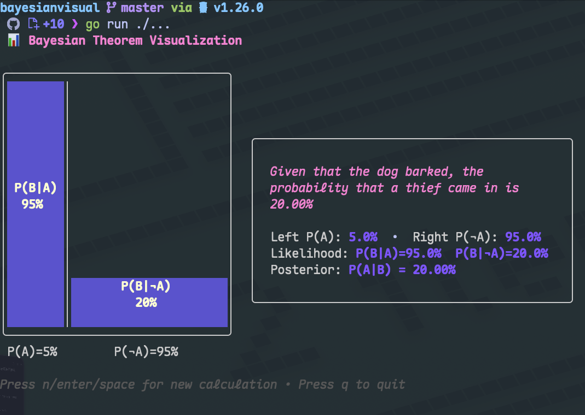

# Bayesian Visual

A terminal-based interactive visualization tool for Bayes' Theorem, built with Go and Bubble Tea.

## Demo



## Features

- 📊 **Interactive Visualization**: Visual representation of Bayesian probability with colored rectangles
- 🔄 **Iterative Calculation**: Use previous posterior probability as new prior for sequential updates
- ✏️ **Custom Descriptions**: Define custom event descriptions for better understanding
- 🎨 **Modern TUI**: Beautiful terminal user interface with intuitive controls
- ⚡ **Real-time Updates**: Instant calculation and visualization of posterior probabilities

## Installation

### Using go install

```bash
go install github.com/sshelll/bayesianvisual/cmd/bayesianvisual@latest
```

### Build from source

```bash
git clone https://github.com/sshelll/bayesianvisual.git
cd bayesianvisual
go build ./cmd/bayesianvisual
```

## Usage

Run the application:

```bash
bayesianvisual
```

Or if built from source:

```bash
./bayesianvisual
```

### Controls

- **n / Enter / Space**: Open calculation menu
- **↑ / ↓ or j / k**: Navigate menu options
- **Enter**: Select menu option
- **Esc**: Go back or cancel
- **q**: Quit application

### Calculation Modes

1. **Iterative Calculation**: Use the previous posterior probability P(A|B) as the new prior P(A)
2. **New Calculation**: Enter all probability values from scratch
3. **Customize Descriptions**: Define what events A and B represent for better context

## How It Works

The visualization displays Bayes' Theorem:

```
P(A|B) = P(B|A) × P(A) / P(B)
```

Where:
- **P(A)**: Prior probability (left side)
- **P(B|A)**: Likelihood given A (blue area on left)
- **P(B|¬A)**: Likelihood given not A (blue area on right)
- **P(A|B)**: Posterior probability (calculated result)

## License

MIT

